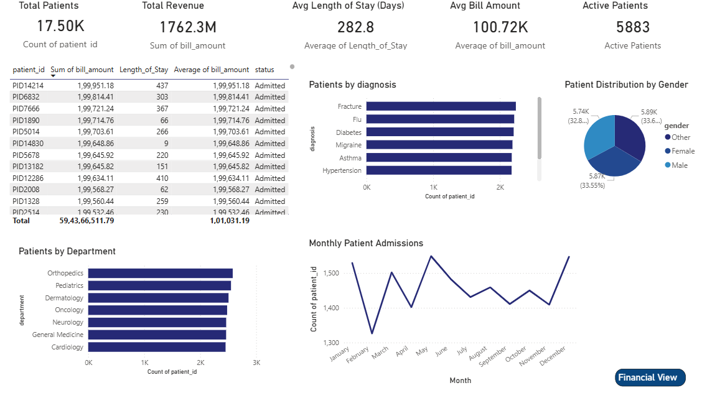
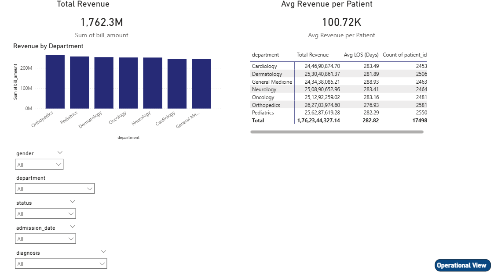

# Healthcare Analytics Dashboard

An interactive Operational and Financial Healthcare Analytics Dashboard built using **Power BI**.

# Project Overview

This dashboard analyzes healthcare performance across operational and financial dimensions.

It is structured into two main views:

# Operational View
- KPI Cards (Total Patients, Active Patients, Avg Length of Stay)
- Patient Distribution by Gender and Diagnosis
- Department-wise Patient Analysis
- Monthly Admission Trends

# Financial View
- Total Revenue
- Average Revenue per Patient
- Revenue by Department
- Department Performance Matrix

Interactive slicers allow dynamic filtering by:
- Gender
- Department
- Diagnosis
- Admission Year
- Status

---

# Skills Demonstrated

- Data Cleaning & Transformation (Power Query)
- Feature Engineering (Length of Stay, Age Group)
- DAX Measures & KPI Calculations
- Data Modeling
- Financial & Operational Reporting
- Interactive Dashboard Design
- Executive-Level KPI Structuring

---

# Dashboard Preview

## Operational View

## Financial View

---

# Tools Used

- Power BI Desktop
- Power Query
- DAX
